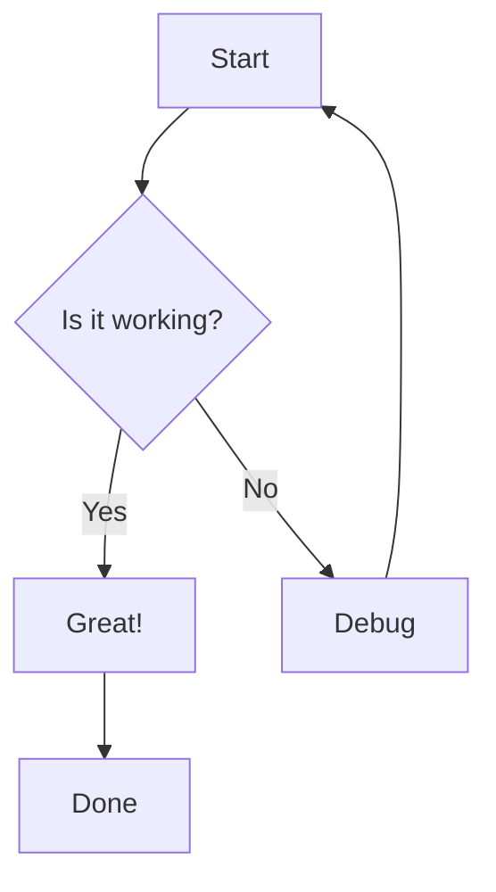
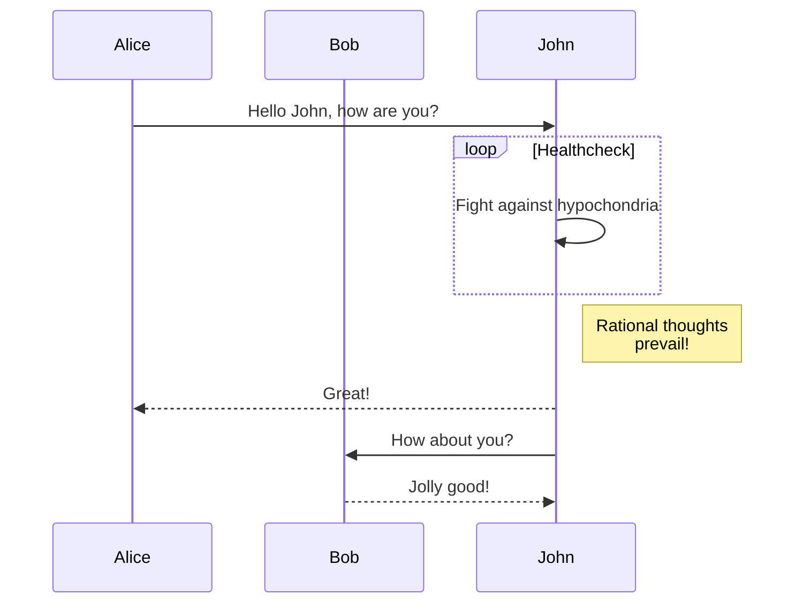
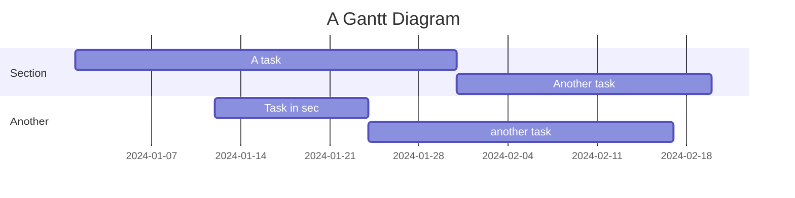
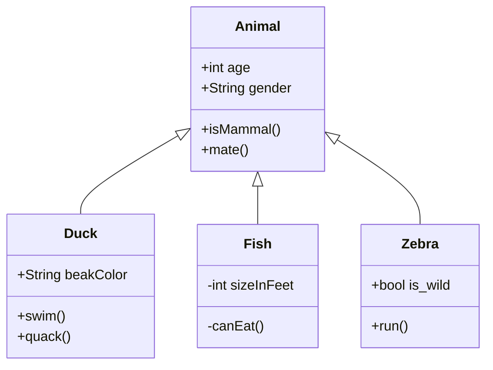
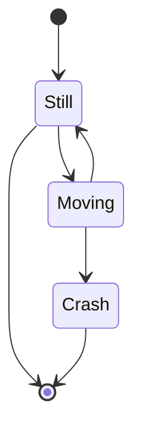
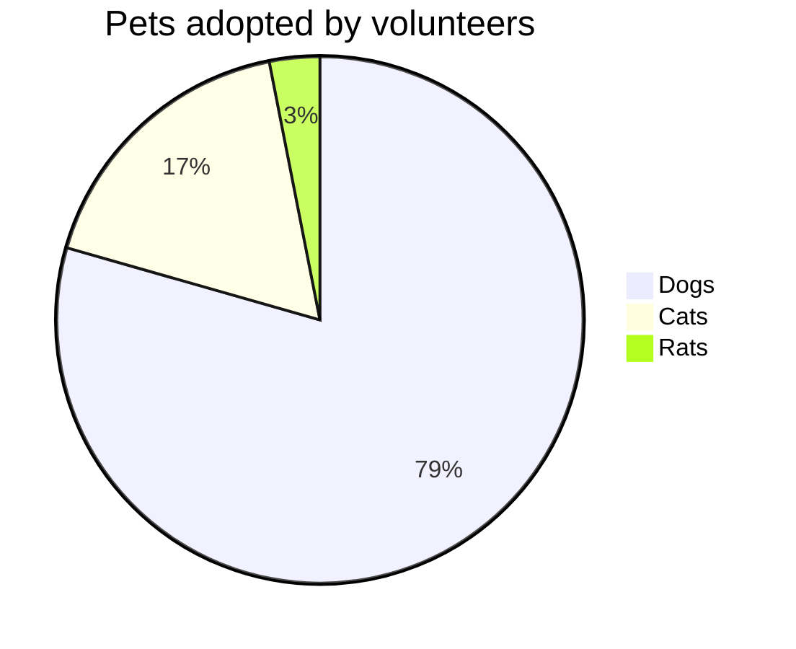
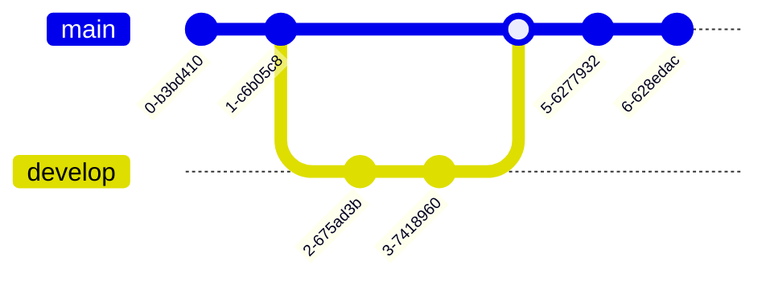
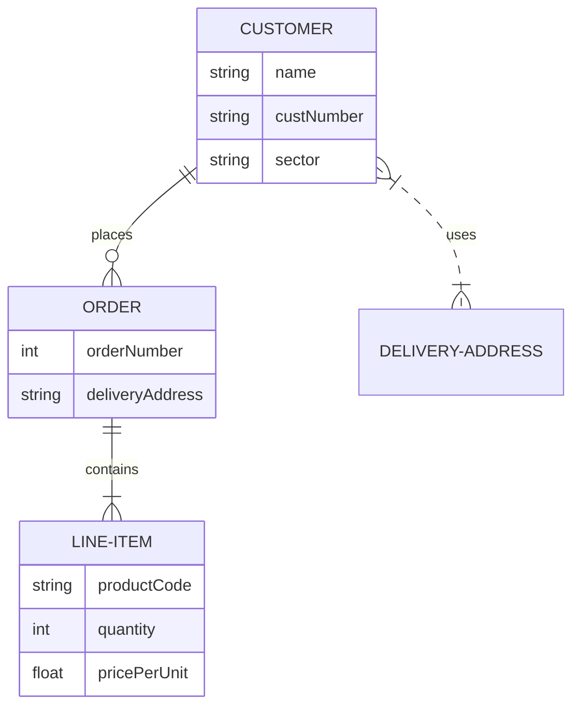
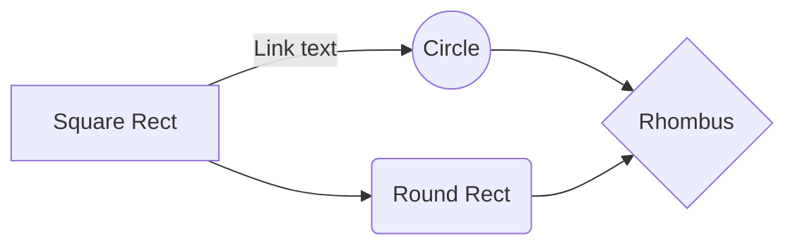

# Mermaid Diagram Examples

This page demonstrates various Mermaid diagram types with dark/light theme support. Try toggling the theme to see diagrams automatically re-render!

## Flowchart



## Sequence Diagram



## Gantt Chart



## Class Diagram



## State Diagram



## Pie Chart



## Git Graph



## Entity Relationship Diagram



## Usage Instructions

To add Mermaid diagrams to your documentation:

1. Create a code block with the language identifier `mermaid`
2. Add your diagram syntax inside the code block
3. The diagram will render automatically on page load
4. Theme switching will automatically re-render diagrams

Example:

````markdown

````
